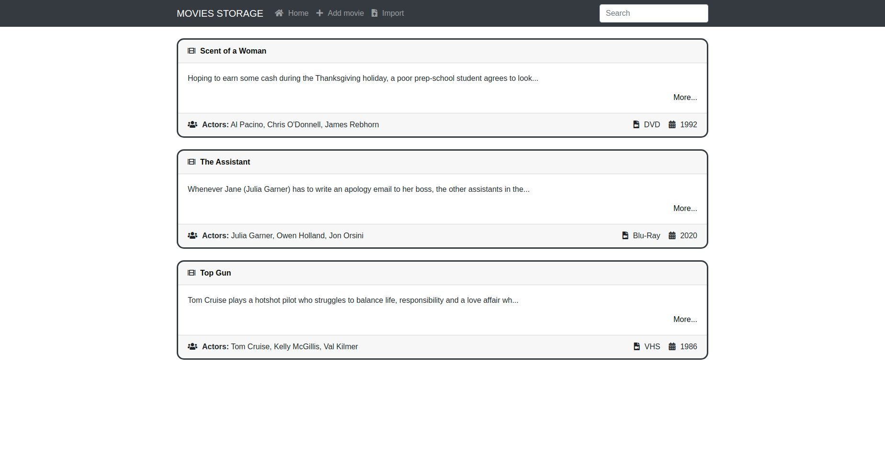

**MOVIES STORAGE**

**Setup:**
1. git clone https://github.com/petrokulybaba/movies-storage.git
2. docker-compose up -d
3. docker-compose exec db sh -c 'cat migrations/*.sql|mysql -u root -proot main'
4. docker-compose exec app sh -c 'php -S 0.0.0.0:8000'
5. Follow http://localhost:8000

**Project structure:**

    .
    ├── /config                 # Directory contains configuration files, such as a DB configuration file and file with routes list
    │   └── /components         # Directory contains classes for initializing connection to database and router
    ├── /migrations             # Directory contains migration files
    ├── /public                 # Directory contains static files such as .css
    ├── /src                    # Source code
    │   ├── Controllers         # Directory contains controllers
    │   ├── Models              # Directory contains models
    │   └── Services            # Directory contains services
    ├── /templates              # Directory contains templates
    └── index.php               # Entry point

**Link on WEB app:** [films-storage.herokuapp.com](https://films-storage.herokuapp.com)
